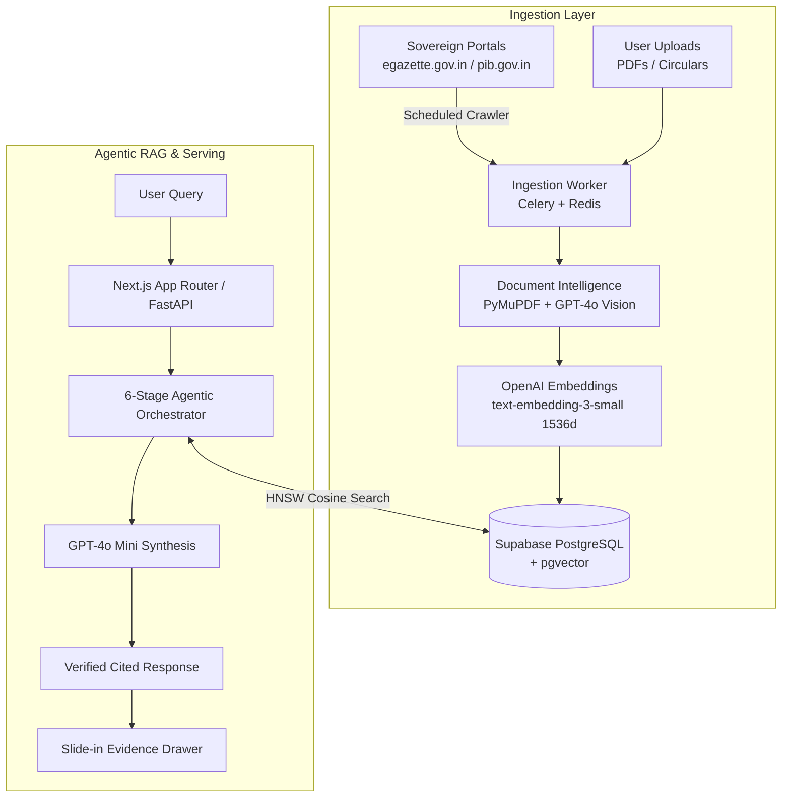

# Pramaan (प्रमाण) — Sovereign Government Document Intelligence & Agentic RAG Platform

> **Understand Government Documents. Without the Paperwork.**  
> A minimal, AI-first sovereign document intelligence system for Indian gazettes, ministry circulars, notifications, and statutory orders — grounded in verifiable evidence with clause-level citations.

---

## 🏛 Overview

**Pramaan** is an enterprise-grade document intelligence platform designed specifically for navigating complex Indian bureaucratic and legal documents. It combines sovereign web crawlers, hybrid OCR layout extraction, high-dimensional vector embeddings, and a 6-stage Agentic RAG orchestrator into a clean, distraction-free workspace.

---

## ✨ Key Features

- **💬 ChatGPT-Style AI Workspace (`/app`)**: 
  - Focused, distraction-free conversational interface with collapsible navigation sidebar.
  - Interactive verbatim citation badges linking directly to specific gazette pages and clauses.
  - Slide-in **Evidence Drawer** showing exact excerpts, confidence scores, and PDF verification links.

- **🤖 6-Stage Agentic RAG Pipeline**:
  1. *Query Understanding & Normalization*
  2. *Orchestrator Agent & Intent Routing*
  3. *Hybrid Dense (pgvector) + Sparse (BM25) Retrieval*
  4. *Multi-Document Reasoning & Statutory Diffing*
  5. *Evidence Validation & Hallucination Guardrails*
  6. *Cited Answer Generation & Dynamic Follow-up Suggestions*

- **📄 Document Intelligence & Hybrid OCR**:
  - **PyMuPDF (`fitz`)**: Instant sub-millisecond clause extraction for native digital PDFs.
  - **GPT-4o Vision OCR**: High-accuracy parsing for scanned physical gazettes, tables, and stamped circulars.

- **🌐 Sovereign Portal Crawler**:
  - Actively polls `egazette.gov.in`, `pib.gov.in`, and central ministry feeds.
  - Automatic deduplication via SHA-256 hash and Gazette numbers.
  - Live **Sync / Crawl Portals** on-demand trigger inside the Documents view.

- **⚖️ Statutory Diff Engine (`/app` ➔ Compare)**:
  - Side-by-side comparison of revised notifications (e.g., 2024 vs 2025 Education Policy, PMAY-G phase norms).
  - Highlights modified compliance clauses, enhanced financial caps, and removed mandates.

---

## 🏗 System Architecture



---

## 🛠 Tech Stack

| Layer | Technology |
| :--- | :--- |
| **Frontend** | Next.js 16 (App Router), React 19, TypeScript, Tailwind CSS, Lucide Icons |
| **Backend / AI Microservice** | FastAPI, Python 3.11, PyMuPDF, LangChain, Celery, Redis |
| **LLMs & Embeddings** | OpenAI `gpt-4o-mini`, `gpt-4o` Vision, `text-embedding-3-small` (1536d) |
| **Database & Vector Store** | Supabase (PostgreSQL 15 + `pgvector` extension with HNSW index) |
| **Auth & Email** | Custom Session Auth + Resend Transactional Verification Emails |
| **Deployment** | Docker, Docker Compose, Vercel / Cloud Run |

---

## 📁 Project Structure

```text
├── README.md                     # Platform Documentation & Guide
├── LICENSE                       # Apache 2.0 / MIT Open Source License
├── requirements.txt              # Root Python Dependencies
├── package.json                  # Root Monorepo Scripts & Orchestration
├── .gitignore                    # Git Exclusion Rules
│
├── src/                          # Project Source Code
│   ├── frontend/                 # Next.js 16 Web Application (App Router, UI, RAG Client)
│   │   ├── src/app/              # Pages: Landing (/), Workspace (/app), Login (/login), API routes
│   │   ├── src/components/       # Visuals, Icons, Layout Components
│   │   └── src/lib/              # Supabase, OpenAI SDK, Auth Sessions
│   ├── backend_ai/               # FastAPI Document Intelligence & Celery Service
│   │   ├── main.py               # REST API Endpoints
│   │   ├── extractor.py          # PyMuPDF & GPT-4o Vision OCR Engine
│   │   ├── crawler.py            # Sovereign Portal Crawler (egazette/pib)
│   │   ├── agent.py              # 6-Stage LangChain RAG Orchestrator
│   │   └── tasks.py              # Background Celery Ingestion Workers
│   └── backend/                  # Node.js Auth & Verification Service
│
├── docs/                         # Documentation & Architecture
│   ├── project-documentation.pdf # Comprehensive Technical Whitepaper
│   ├── architecture.png          # System Architecture & Storage Tiering
│   └── other-diagrams/           # Extended Data Flow & Sequence Diagrams
│
├── screenshots/                  # High-Resolution UI Walkthroughs
│   ├── screenshot-1.png          # Landing Page (Pramaan Sovereign UI)
│   └── screenshot-2.png          # Authenticated AI Workspace (ChatGPT-Style)
│
└── data/                         # Sovereign Datasets & Schemas
    └── README.md                 # Gazette Crawl Targets & pgvector Schemas
```

---

## ⚙️ Environment Configuration

Create a `.env` file in the root and `frontend/.env.local` with the following keys:

```env
# Supabase PostgreSQL & pgvector
NEXT_PUBLIC_SUPABASE_URL=https://<YOUR-PROJECT-ID>.supabase.co
NEXT_PUBLIC_SUPABASE_ANON_KEY=your_supabase_anon_key

# OpenAI (Powers GPT-4o Mini, GPT-4o Vision OCR & text-embedding-3-small)
OPENAI_API_KEY=sk-proj-your_openai_api_key

# Resend Email Service (For verification codes)
RESEND_API_KEY=re_your_resend_api_key

# Redis (For background Celery crawler queue)
REDIS_URL=redis://localhost:6379/0
```

---

## 🗄️ Database Setup (Supabase pgvector)

Run the following SQL migration in your **Supabase SQL Editor** to initialize the tables and vector search function:

```sql
-- 1. Enable pgvector extension
CREATE EXTENSION IF NOT EXISTS vector;

-- 2. Documents table
CREATE TABLE IF NOT EXISTS documents (
  id UUID PRIMARY KEY DEFAULT gen_random_uuid(),
  title TEXT NOT NULL,
  ministry TEXT NOT NULL,
  doc_type TEXT NOT NULL,
  gazette_number TEXT,
  publication_date DATE,
  file_url TEXT,
  file_size TEXT,
  status TEXT DEFAULT 'Indexed',
  created_at TIMESTAMP WITH TIME ZONE DEFAULT NOW()
);

-- 3. Document chunks table with 1536-dim embeddings
CREATE TABLE IF NOT EXISTS document_chunks (
  id UUID PRIMARY KEY DEFAULT gen_random_uuid(),
  document_id UUID REFERENCES documents(id) ON DELETE CASCADE,
  content TEXT NOT NULL,
  section TEXT,
  clause TEXT,
  page_number INTEGER,
  embedding VECTOR(1536),
  created_at TIMESTAMP WITH TIME ZONE DEFAULT NOW()
);

-- 4. HNSW Vector Index for fast cosine similarity retrieval
CREATE INDEX IF NOT EXISTS document_chunks_embedding_hnsw_idx 
ON document_chunks 
USING hnsw (embedding vector_cosine_ops);

-- 5. Match Document Chunks RPC Function
CREATE OR REPLACE FUNCTION match_document_chunks (
  query_embedding VECTOR(1536),
  match_count INT DEFAULT 5,
  filter_ministry TEXT DEFAULT NULL
)
RETURNS TABLE (
  id UUID,
  document_id UUID,
  content TEXT,
  section TEXT,
  clause TEXT,
  page_number INT,
  similarity FLOAT
)
LANGUAGE plpgsql
AS $$
BEGIN
  RETURN QUERY
  SELECT
    dc.id,
    dc.document_id,
    dc.content,
    dc.section,
    dc.clause,
    dc.page_number,
    1 - (dc.embedding <=> query_embedding) AS similarity
  FROM document_chunks dc
  ORDER BY dc.embedding <=> query_embedding
  LIMIT match_count;
END;
$$;
```

---

## 🚀 Quick Start

### 1. Run the Frontend (Next.js)

```bash
cd frontend
npm install
npm run dev
```
Open [http://localhost:3000](http://localhost:3000) to view the landing page, or [http://localhost:3000/app](http://localhost:3000/app) for the authenticated AI workspace.

### 2. Run the Backend AI Microservice (FastAPI + Celery)

```bash
cd backend_ai
python -m venv .venv
# On Windows: .venv\Scripts\activate | On Linux/macOS: source .venv/bin/activate
pip install -r requirements.txt
python main.py
```
The FastAPI documentation will be available at [http://localhost:8000/docs](http://localhost:8000/docs).

### 3. Run with Docker Compose (Full Stack)

```bash
docker-compose up --build
```

---

## 🔒 Security & Compliance

- **Sovereignty**: Designed to operate with local or cloud sovereign data stores without leaking confidential government drafts.
- **Verifiability**: Every AI generation enforces verbatim quotes and direct link mapping to official gazettes.
- **Strict Guardrails**: Refuses speculative assertions that lack direct citation in indexed gazette notifications.

---

## 📜 License

Licensed under the [Apache License 2.0](LICENSE).
