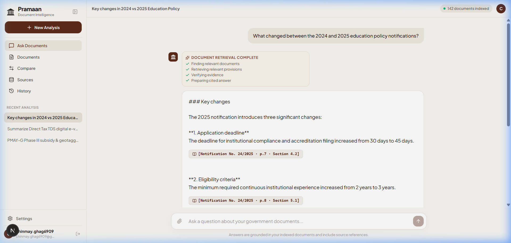
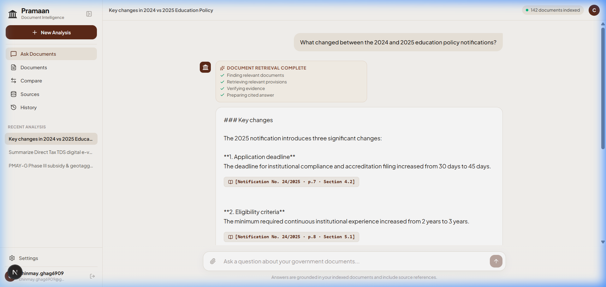
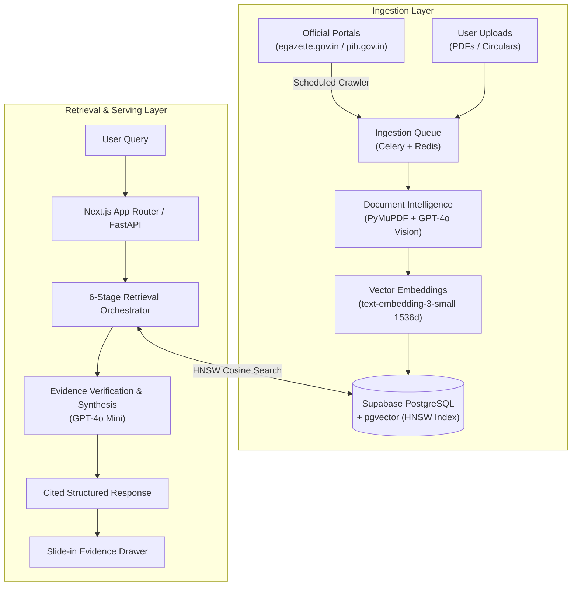

# Pramaan (प्रमाण)
### Sovereign Government Document Intelligence & Verifiable Policy Retrieval Platform

[](LICENSE)
[-black)](https://nextjs.org/)
[](https://fastapi.tiangolo.com/)
[](https://github.com/pgvector/pgvector)
[](https://openai.com/)

---

## 🏛 Executive Summary

**Pramaan** (Sanskrit for *proof*, *evidence*, or *source of valid knowledge*) is a sovereign document intelligence and agentic retrieval platform engineered specifically for Indian government gazettes, ministry circulars, notifications, and statutory orders.

Indian administrative and legal publications present significant challenges: thousands of daily notifications scattered across disparate departmental portals, complex legal cross-references across multiple fiscal years, and low-fidelity scanned physical documents with stamps and bilingual text.

Pramaan bridges the gap between complex government documents and actionable compliance knowledge by pairing automated portal crawlers with hybrid document layout extraction (PyMuPDF + GPT-4o Vision), high-dimensional vector search (`pgvector`), and a multi-stage retrieval pipeline that enforces **verifiable, clause-level evidence attribution** with zero hallucination tolerance.

---

## 🔍 The Problem & Architectural Vision

| Challenge | Traditional Approach | Pramaan's Solution |
| :--- | :--- | :--- |
| **Document Fragmentation** | Manual search across dozens of ministry websites (eGazette, PIB, CBDT, MeitY). | **Automated Sovereign Crawlers** actively polling government feeds with deduplication and indexing. |
| **Format Heterogeneity** | Standard OCR fails on low-contrast stamps, tables, and mixed Hindi/English text. | **Hybrid Extraction Engine** using PyMuPDF for native PDFs and GPT-4o Vision for scanned gazettes. |
| **Statutory Cross-Referencing** | Time-consuming manual diffing of amendments across fiscal years. | **Statutory Comparison Engine** identifying modified clauses, altered thresholds, and deleted mandates. |
| **LLM Hallucinations** | Generic AI answers with plausible-sounding but non-existent rules or dates. | **Deterministic Evidence Validation** with clickable clause citations and an interactive **Evidence Drawer**. |

---

## 📸 Platform Overview

| Public Portal Interface | Authenticated Workspace & Evidence Drawer |
| :---: | :---: |
|  |  |

---

## ⚡ Key Capabilities

### 1. Evidence-Grounded Conversational Workspace (`/app`)
- Distraction-free conversational interface designed specifically for regulatory and statutory analysis.
- Every factual claim is embedded with a verifiable citation tag: `[Notification No. · Page · Section · Clause]`.
- Clicking any citation badge opens the **Slide-in Evidence Drawer**, displaying the verbatim excerpt, confidence score, and a direct link to the original official PDF.

### 2. Multi-Stage Agentic Retrieval Pipeline
Unlike standard single-pass RAG systems that concatenate raw text chunks, Pramaan executes queries through six discrete verification stages:
1. **Query Normalization**: Identifies Indian legal taxonomy, statutory circular identifiers, and ministry hierarchies.
2. **Intent Routing**: Routes requests between single-document clause lookup, cross-year amendment diffing, and cross-ministry synthesis.
3. **Hybrid Dense + Sparse Retrieval**: Executes 1536-dimensional cosine similarity searches over `pgvector` alongside metadata filters.
4. **Multi-Document Reasoning**: Reconciles chronological amendments and superseding notifications.
5. **Evidence Validation & Guardrails**: Enforces that generated statements are directly supported by retrieved gazette text.
6. **Cited Synthesis**: Produces structured answers with interactive citations and dynamic follow-up recommendations.

### 3. Hybrid Document Processing Engine
- **PyMuPDF (`fitz`)**: Sub-millisecond layout extraction, paragraph chunking, and metadata parsing for digital-born PDFs.
- **GPT-4o Vision OCR**: High-accuracy transcription and tabular data recovery for legacy scanned physical gazettes with administrative stamps and signatures.

### 4. Sovereign Portal Ingestion & Active Crawling
- Crawlers target official portals including `egazette.gov.in`, `pib.gov.in`, and central ministry feeds.
- SHA-256 hash checking and gazette number indexing ensure zero redundant processing.
- Supports both background Celery worker polling and on-demand UI synchronization via the **"Sync / Crawl Portals"** trigger.

### 5. Statutory Comparison Engine (`/app` ➔ Compare)
- Side-by-side analysis of policy iterations (e.g., *2024 vs 2025 Education Policy Notifications*, *PMAY-G phase norms*).
- Highlights modified compliance clauses, revised fiscal caps, and newly introduced mandates.

---

## 🏗 System Architecture



---

## 🛠 Tech Stack

| Layer | Technology | Details |
| :--- | :--- | :--- |
| **Frontend** | Next.js 16 (App Router), React 19, TypeScript | Server and client components, Tailwind CSS styling |
| **AI Microservice** | FastAPI, Python 3.11, Uvicorn | REST endpoints for extraction, vectorization, and RAG |
| **Document Processing** | PyMuPDF (`fitz`), OpenAI GPT-4o Vision | Hybrid digital and scanned OCR layout extraction |
| **Orchestration** | LangChain, Celery, Redis | Background task queuing, query normalization, routing |
| **Models & Embeddings** | OpenAI `gpt-4o-mini`, `text-embedding-3-small` | 1536-dimensional dense vector embeddings |
| **Database & Vector Store** | PostgreSQL 15 + `pgvector` (Supabase) | HNSW cosine similarity index for sub-15ms queries |
| **Authentication & Delivery**| Custom Session Auth + Resend API | 6-digit email verification and session tokens |
| **Deployment** | Docker, Docker Compose | Multi-container configuration for all services |

---

## 📁 Repository Structure

```text
├── README.md                     # Platform documentation and setup
├── LICENSE                       # Apache 2.0 Open Source License
├── requirements.txt              # Root Python dependencies for AI microservice
├── package.json                  # Root monorepo scripts
├── docker-compose.yml            # Multi-service container configuration
├── .gitignore                    # Version control ignore rules
│
├── src/                          # Application source code
│   ├── frontend/                 # Next.js 16 web application
│   │   ├── src/app/              # App router pages: Landing (/), App (/app), Login (/login), API routes
│   │   ├── src/components/       # UI components, icons, and layout visuals
│   │   └── src/lib/              # Supabase client, OpenAI client, and auth helpers
│   ├── backend_ai/               # FastAPI microservice and Celery workers
│   │   ├── main.py               # REST API endpoints
│   │   ├── extractor.py          # PyMuPDF and Vision OCR processing
│   │   ├── crawler.py            # Sovereign portal crawler service
│   │   ├── agent.py              # Multi-stage retrieval orchestrator
│   │   ├── tasks.py              # Async Celery ingestion tasks
│   │   └── celery_app.py         # Celery instance configuration
│   └── backend/                  # Node.js authentication service
│
├── docs/                         # Documentation and architectural diagrams
│   ├── project-documentation.pdf # Complete technical whitepaper
│   ├── architecture.png          # System architecture visual
│   └── other-diagrams/           # Data flow and component diagrams
│
├── screenshots/                  # High-resolution application captures
│   ├── screenshot-1.png          # Public landing page
│   └── screenshot-2.png          # Authenticated workspace interface
│
└── data/                         # Datasets and schemas
    └── README.md                 # Table definitions and portal crawl targets
```

---

## ⚙️ Environment Configuration

Create a `.env` file in the root directory (and `src/frontend/.env.local` for the Next.js app) with the following variables:

```env
# Database & Vector Store (Supabase PostgreSQL)
NEXT_PUBLIC_SUPABASE_URL=https://<YOUR-PROJECT-ID>.supabase.co
NEXT_PUBLIC_SUPABASE_ANON_KEY=your_supabase_anon_key

# OpenAI (Powers reasoning, Vision OCR, and vector embeddings)
OPENAI_API_KEY=sk-proj-your_openai_api_key

# Transactional Email (Resend)
RESEND_API_KEY=re_your_resend_api_key

# Background Task Queue (Redis)
REDIS_URL=redis://localhost:6379/0
```

---

## 🗄️ Database Setup (Supabase pgvector)

Run the following SQL migration in your **Supabase SQL Editor** to enable the vector extension and create the required tables and search function:

```sql
-- 1. Enable pgvector extension
CREATE EXTENSION IF NOT EXISTS vector;

-- 2. Documents metadata registry
CREATE TABLE IF NOT EXISTS documents (
  id UUID PRIMARY KEY DEFAULT gen_random_uuid(),
  title TEXT NOT NULL,
  ministry TEXT NOT NULL,
  doc_type TEXT NOT NULL,
  gazette_number TEXT,
  publication_date DATE,
  file_url TEXT,
  file_size TEXT,
  status TEXT DEFAULT 'Indexed',
  created_at TIMESTAMP WITH TIME ZONE DEFAULT NOW()
);

-- 3. Document chunks table with 1536-dimensional embeddings
CREATE TABLE IF NOT EXISTS document_chunks (
  id UUID PRIMARY KEY DEFAULT gen_random_uuid(),
  document_id UUID REFERENCES documents(id) ON DELETE CASCADE,
  content TEXT NOT NULL,
  section TEXT,
  clause TEXT,
  page_number INTEGER,
  embedding VECTOR(1536),
  created_at TIMESTAMP WITH TIME ZONE DEFAULT NOW()
);

-- 4. HNSW Vector Index for fast cosine similarity retrieval
CREATE INDEX IF NOT EXISTS document_chunks_embedding_hnsw_idx 
ON document_chunks 
USING hnsw (embedding vector_cosine_ops);

-- 5. Match Document Chunks RPC Function
CREATE OR REPLACE FUNCTION match_document_chunks (
  query_embedding VECTOR(1536),
  match_count INT DEFAULT 5,
  filter_ministry TEXT DEFAULT NULL
)
RETURNS TABLE (
  id UUID,
  document_id UUID,
  content TEXT,
  section TEXT,
  clause TEXT,
  page_number INT,
  similarity FLOAT
)
LANGUAGE plpgsql
AS $$
BEGIN
  RETURN QUERY
  SELECT
    dc.id,
    dc.document_id,
    dc.content,
    dc.section,
    dc.clause,
    dc.page_number,
    1 - (dc.embedding <=> query_embedding) AS similarity
  FROM document_chunks dc
  ORDER BY dc.embedding <=> query_embedding
  LIMIT match_count;
END;
$$;
```

---

## 🚀 Getting Started

### 1. Run the Frontend (Next.js)

```bash
# From repository root
npm run dev

# Or directly from the frontend directory
cd src/frontend
npm install
npm run dev
```
Open **`http://localhost:3000`** in your browser to view the application.

### 2. Run the AI Microservice (FastAPI + Celery)

```bash
cd src/backend_ai
python -m venv .venv

# Activate virtual environment
# Windows: .venv\Scripts\activate | macOS/Linux: source .venv/bin/activate
pip install -r requirements.txt
python main.py
```
FastAPI interactive documentation will be accessible at **`http://localhost:8000/docs`**.

### 3. Run Full Stack via Docker Compose

```bash
docker-compose up --build
```

---

## 🔒 Security, Sovereignty & Compliance

- **Sovereign Data Handling**: Engineered for deployment on sovereign clouds without transmitting sensitive data outside designated boundaries.
- **Strict Evidence Guardrails**: Rejects speculative assertions that cannot be directly mapped to an authoritative gazette notification.
- **Auditability**: Every generated insight preserves end-to-end provenance with clause, section, and page coordinates.

---

## 📜 License

This project is licensed under the **Apache License 2.0** — see the [LICENSE](LICENSE) file for details.
